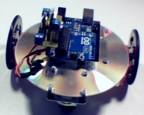

<!--# SimpleCDBot -->
<!--$ Arduino-->
<!--$ Electronique -->
<!--% Un robot pédagoqique -->
### SimpleCDBot

Un robot pédagogique

- Librairie contenant les fonctions utiles pour le simpleCDBot, robot d'initiation à 2 servomoteurs à rotation continue. 
Nécessite l'utilisation de la librairie Utils pour permettre le contrôle du robot directement depuis le port série. 
